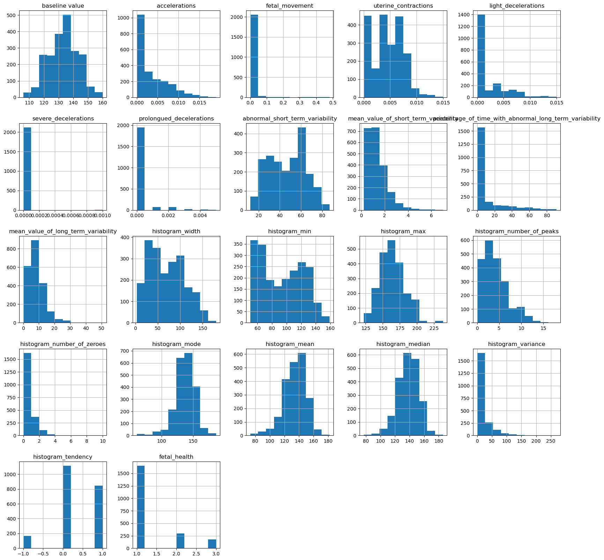
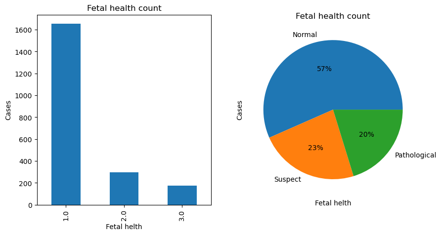
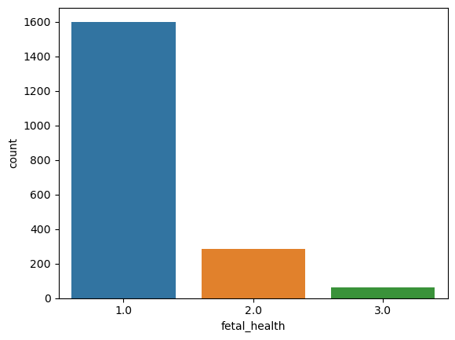
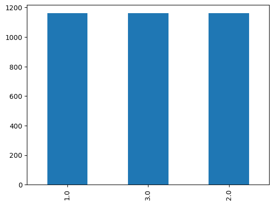
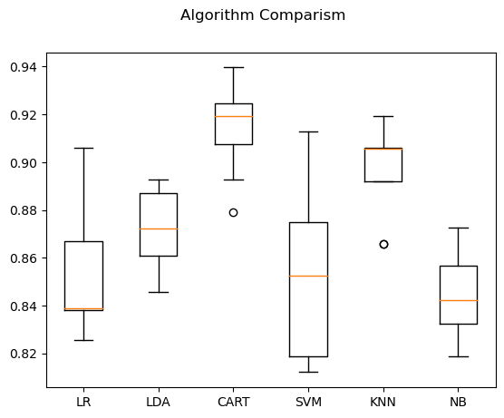
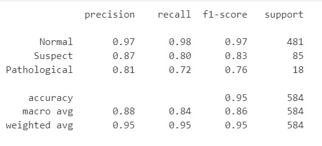
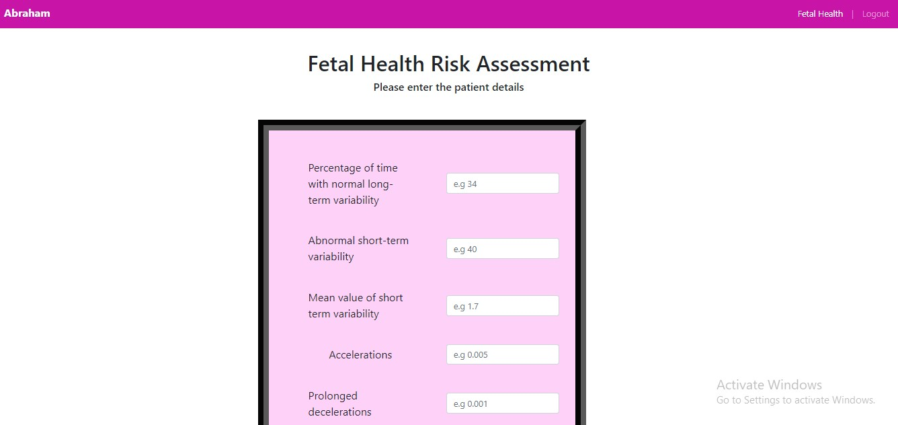
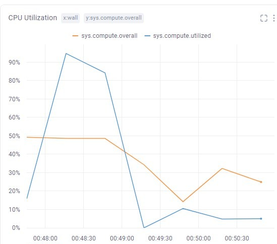

# Fetal Health Risk Detection using Machine Learning with Flask Web App

## Introduction 
What is fetal health risk?
Fetal health risk refers to any condition or factor that could potentially harm a developing fetus during pregnancy. These risks can lead to complications such as birth defects, developmental delays, preterm birth, or even miscarriage. 

What can lead to fetal health risk? fetal health problems can be caused by maternal age, lifestyle choices, pre-existing medical conditions, pregnancy complications and structural problems.

*Source(https://www.healthline.com/health/pregnancy/risk-factors)*

## Patient Problem
### Problem Context
According to the UNICEF, the neonatal period is the most vulnerable time for a child. Globally, 2.3 million children died in the first month of life in 2022 – approximately 6,300 neonatal deaths every day.

*Source: (https://data.unicef.org/topic/child-survival/neonatal-mortality/)*

## Objective(s)
- My main aim in this project is to use machine learning to detect fetal health risks which in turn can prevent fetal and maternal mortality. I intend to use classification algorithms to achieve the lowest error in prediction.

## Dataset Information
The dataset was sourced from the University of California Irvine dataset archive consisting of over 2126 Cardiotogram (CTGs) measurements of fetal heart rate (FHR) and uterine contraction (UC) features classified by expert obstetricians.

    
*Data Source:*(https://archive.ics.uci.edu/dataset/193/cardiotocography)

## Mapping Patient Problem to ML Problem

### Type of Machine Learning Problem
+ It is a binary classification problem, where given the above set of features, I need to classify and predict fetal health risks.

## Data Analysis Workflow
- Data Collection
- Importing Data
- Data Cleaning
  - Handling Missing Data
  - Outlier Detection and Removal
- Data Transformation
- Exploring Data using Descriptive Statistics
  - Understanding Data using
    - Univariate Analysis
    - Bivariate Analysis
    - Multivariate Analysis
- Understanding Data using Visualizations
    - Univariate
      - Histograms
      - Density Plot
    - Bivariate
      - Boxplot
    - Multivariate
      - Correlation Matrix

### Observations
1. From the pathological records, the features of fetal movements, uterine conttractions, and the interval range of heart rate values strongly correlated with deceleration rates in higher proportionals.

2. Among the suspect and normal records, the plots representing the increased accelerations but not deceleration. Therefore, both pathological and suspect records achieving more decelerations.

3. Pathological records have higher values of percentage of time with long term variability and abnormal short term variability.

4. Pathological records have lower metrics for mode, median, and mean for cardiotocography exams among their graph tendencies, while normal records have higher values for these metrics. This correlates with their cardiotocography graphs.

## Model Building 
+ Features Selection
+ Data Train/Test/Split
+ Algorithm Comparisms
    - Logistic Regression
    - K-Nearest Neighbour
    - Decision Tree Classifier
    - Support Vector Machine
    - Linear Discriminant Analysis
+ Serialize (Save Model)

## Model Interpretation
 + I implemented explainable AI techniques using Decision Tree and model interpretation to understand the decisions made by the black-box machine learning model for individual patients. With this technique, healthcare professionals can gain insights into which features are most influential in predicting the patient's outcome (i.e., Normal, Suspected or Pathological). 

## Model Evaluation Metrics
Since this is a binary classification problem, I used the following metrics:
* **Confusion matrix** - For getting a better clarity of the number of correct/incorrect predictions made by the model.
* **Classification report** - For providing insights into the model's performance.
* **Accuracy score** - To evaluate the overall performance of the classification model.

## Project Highlight(s)
 + Model achieved an overall performance accuracy of >90% using K-Nearest Neigbour Machine Learning Algorithm.

## Data-Driven Solution 
  ### Deploying the Model with a Flask Web App
 + To make the model accessible to end-users, I have developed a user-friendly Flask web application. The Flask web app provides a friendly user interface where users can input relevant parameters through a web form. Upon submission, the app processes the input data using the accurately trained cloud based machine learning model and provides the predicted outcome (Normal, Pathological or Suspected). A screenshot of the Flask web app is shown below;  

## Model Monitoring and Maintenance 
- I leveraged a robust cloud ML platform and implemented a quality control check, experiment tracking, model maintenance and model monitoring techniques to observe data drift and prevent performance degradation. This is to help ensure model fairness, improve model performance and maintain model reliability.

## Technologies Used
- Python 
- Coding Tools
   - VS Code
   - Lightning.ai
- ML Libraries 
  - Scikit-Learn
  - Pandas
  - Numpy
  - Matplotlib
  - Seaborn
  - Lime
  - Joblib
  - Comet ML
- Web App Frameworks 
  - Flask
  - Bootstrap 
  - HTML
  - CSS
  - JavaScript 

## Data Source
The dataset was sourced from the University of California Irvine dataset archive consisting of over 2126 Cardiotogram (CTGs) measurements of fetal heart rate (FHR) and uterine contraction (UC) features classified by expert obstetricians.(https://archive.ics.uci.edu/dataset/193/cardiotocography).

## Conclusion
As an AI Engineer and a medical student, I am deeply committed to the holistic well-being of mothers and their children. This project reflects my dedication to working towards the 2030 UN SDG goal 3 of ending all preventable deaths under five years of age using machine learning techniques and a Data-Driven approach.

## Contact
I'm Abraham Obianke. For any inquiries, feedback or collaborations feel free to [Connect with me on LinkedIn](https://www.linkedin.com/in/abraham-obianke-269112197?utm_source=share&utm_campaign=share_via&utm_content=profile&utm_medium=android_app) or send me an Email via  [abrahamoaks@gmail.com](mailto:your_email@example.com).

### References 
1. Healthline (https://www.healthline.com/health/pregnancy/risk-factors)
2. University of California Irvine dataset archive (https://archive.ics.uci.edu/dataset/193/cardiotocography)
2. The United Nations Children's Fund (UNICEF) (https://data.unicef.org/topic/child-survival/neonatal-mortality/)

